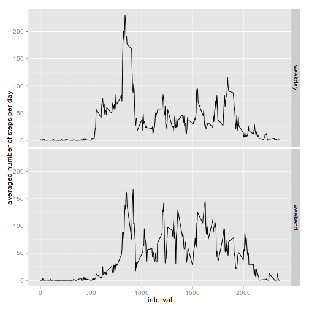

This is the assignment for the 2nd week of the *Reproducible Research* course 
by the Johns Hopkins University on Coursera.

The dataset used is the [*activity monitoring data*](https://d396qusza40orc.cloudfront.net/repdata%2Fdata%2Factivity.zip) 
available on the [GitHub repository created for this assigment](https://github.com/rdpeng/RepData_PeerAssessment1).


## Loading and preprocessing the data
To process the dataset, the following R packages are used:

```r
library(dplyr)
library(ggplot2)
```

To read the data, the CSV file is searched for and, if missing, an attempt to
extract it from the zipped archive is made:


```r
DSFILE <- 'activity.csv'            # filename of our dataset
zippedDS <- 'activity.zip'          # name of the zipped dataset

if (!file.exists(DSFILE)) {         # is the dataset file there?
    if (!file.exists(zippedDS)) {   # is the zipped dataset there, at least?
        stop(paste('Cannot find',zippedDS))     # exit with error
    } 
    unzip(zipfile = zippedDS, overwrite = TRUE) # extract the dataset
}

DS <- tbl_df(read.csv(file = DSFILE, header = TRUE)) %>%
    # fix the date variable:
    mutate(date=as.Date(date, format = '%Y-%m-%d'))
```

Here follow the answers to the questions asked in the assignment.

## What is mean total number of steps taken per day?
For this first part of the assigment, the NA values in the dataset are ignored.

```r
reshapedDS <- DS %>% group_by(date) %>% summarise(s=sum(steps)) 
hist(reshapedDS$s,  main = 'Total number of steps per day', xlab='')
```

 

Let's have a quick look at the *mean* and the *median* of the total number of steps per day:

```r
mean(reshapedDS$s, na.rm = TRUE)
```

```
## [1] 10766.19
```

```r
median(reshapedDS$s, na.rm = TRUE)
```

```
## [1] 10765
```


## What is the average daily activity pattern?
Let's make a new data table with the average number of steps taken, averaged
across all days:

```r
averagedDS <- DS %>% group_by(interval) %>% summarise(avg=mean(steps, na.rm=TRUE))
plot(averagedDS, type='l')
```

 

Which 5-minute interval, on average across all the days in the dataset, contains the maximum number of steps?

```r
which.max(averagedDS$avg)
```

```
## [1] 104
```

```r
averagedDS[which.max(averagedDS$avg),]
```

```
## Source: local data frame [1 x 2]
## 
##   interval      avg
## 1      835 206.1698
```
The answer is: interval number 835 
(at row 104), with 
206.1698113 average steps

## Imputing missing values
Some observations have missing "steps" values, for example:

```r
head(DS)
```

```
## Source: local data frame [6 x 3]
## 
##   steps       date interval
## 1    NA 2012-10-01        0
## 2    NA 2012-10-01        5
## 3    NA 2012-10-01       10
## 4    NA 2012-10-01       15
## 5    NA 2012-10-01       20
## 6    NA 2012-10-01       25
```
Here we are asked to replace the NA values with some valid and meaningful data,
for example the *mean* computed before, in order to avoid the introduction of 
bias into some calculations.

How many missing values are in the dataset?

```r
sum(is.na(DS$steps))
```

```
## [1] 2304
```

Let's complete the observations with missing steps values by replacing "NA"s 
with the average of the steps for the time interval to which that observation belongs:

```r
filledDS <- merge(DS, averagedDS, by="interval")         # merge DS with the averages
naLocations <- is.na(filledDS$steps)                     # where are the NAs?
filledDS$steps[naLocations] <- filledDS$avg[naLocations] # replace NAs
```

How different is now the histogram of the total number of steps?

```r
reshapedFilledDS <- filledDS %>% group_by(date) %>% summarise(s=sum(steps)) 
hist(reshapedFilledDS$s, main = 'Total number of steps per day (adjusted)', xlab='')
```

 

And the *mean* and *median* values? 

```r
mean(reshapedFilledDS$s)
```

```
## [1] 10766.19
```

```r
median(reshapedFilledDS$s)
```

```
## [1] 10766.19
```

It can be noticed that the median value shifted up and is now none of the values
of the original dataset: this is ignored for the purpose of this assignement,
but in other cases this should normally be avoided - for instance, instead of
filling NAs with the *mean*, the original *median* itself could have been used,
and the new median computed would still have been one of the values in the
original dataset.


## Are there differences in activity patterns between weekdays and weekends?
First, add a new column to our (filled) dataset to indicate which type of day
the observation refers to:

```r
filledDS$dayType <- 
    ifelse(weekdays(filledDS$date) %in% c('Saturday','Sunday'),
           'weekend',
           'weekday')
```

And then prepare another dataset, with the average per interval type and day type:

```r
averagedFilledDS <- filledDS %>% group_by(interval,dayType) %>% summarise(avg=mean(steps))
g <-ggplot(averagedFilledDS,              # the dataset
           aes(interval,                  # aesthetics: x
               avg                        #             y
           )) +
    facet_grid(dayType ~ .) +             # plot a different graph per type
    guides(fill=FALSE) +                  # no legend needed, we use facets
    geom_line() +                         # the type of geometry (line)
    ylab('averaged number of steps per day')  # description f Y axis

print(g)                                  # plot!
```

 

It can be noticed that the activities in the weekdays have the highest peak and
seem to "start earlier" in the day (after time interval #500), while the ones
in the weekend "start later" (maybe because people wake up later on non-working
days?) and have in general more peaks, although lower than the highest one
in the weekdays.
